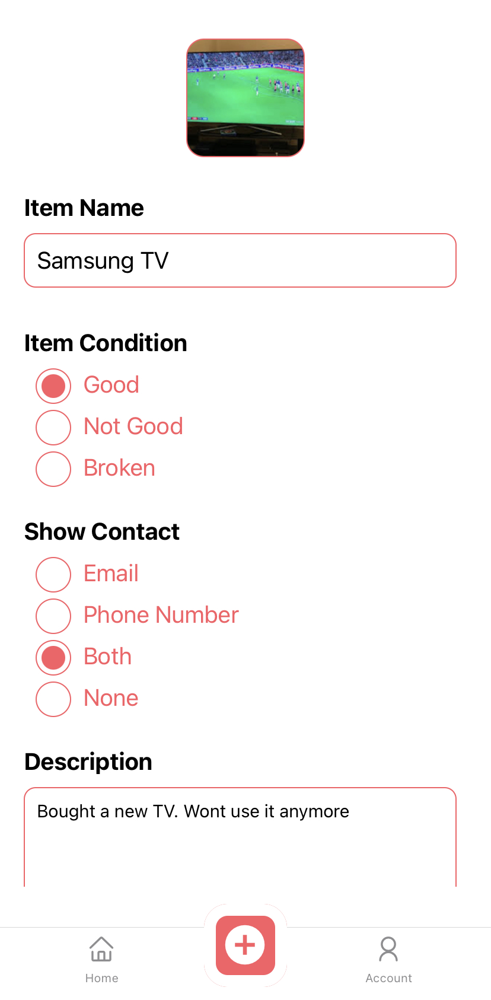

# NotForSale
NotForSale ia a Mobile Application for both iOS and Android which is implemented using React Native and Firebase. 

Users can see free Giveaways nearby their current location and contact the donor for the desired item. The details of the item and the contact information will be provided byu the donor.

## Home Page
The markers on the items gives the location of the giveaways. We can check the item and it's details by selecting each marker.

  

## Item Details
We can see the Decription, condition and contact deatils will be shown in the Item details page. This can be achieved by clicking on View Details button on the marker.

  

## Add Item
User can also add an item which they want to giveaway. You will be asked to give few details regarding the item. Item will be marked to the location from where you added the item to avoid fake activities. 

   
